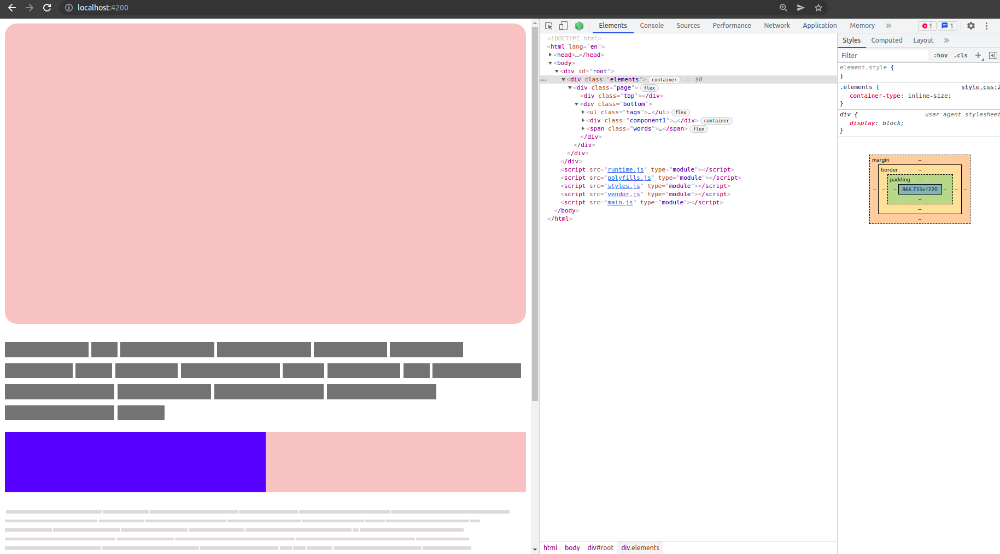

# LABORATORY-CSS-CONTAINER-QUERY



This laboratory is a react project where I am testing how to use the CSS Container Query and what is the result. I am testing on a single page two containers. One container rules the entire page such as what will be done using a media query and the other one rules the Component1. Even used on the whole page, this is a good practice since I can turn my page into a component and the rules will still work the same way. It can be really useful in a microfrontend architecture where we can reassamble in our host an application that has already been designed for responsive.

With container queries, you’ll be able to define a component’s full range of styles in a very precise and predictable way. Perhaps you want to increase or decrease padding, change font sizes, add or remove background images, or completely change the display property and orientation of child elements. This is what CSS Container Queries is about and what everyone is so excited about it!

## How to use

**CSS container queries is an experimental feature. To enable its support in DevTools, under chrome://flags, set the Enable CSS Container Queries experiment to Enabled.
**

For using the CSS Container query, you need to define a property as a container using the property: **container-type**

```css
.component1 {
  container-type: inline-size;
}
```

Once done, I can use this property to define my query based on the size of this container.

```css
@container (min-width: 300px) {
  .component1_child {
    width: 50%;
    background: blue;
  }
}
```

## Running

Since it's a NX workspace, you can run the app using:

```bash
$ nx serve app
```

## Links

- [https://developer.chrome.com/docs/devtools/css/container-queries/](https://developer.chrome.com/docs/devtools/css/container-queries/)
- [https://ishadeed.com/article/say-hello-to-css-container-queries/](https://ishadeed.com/article/say-hello-to-css-container-queries/)
